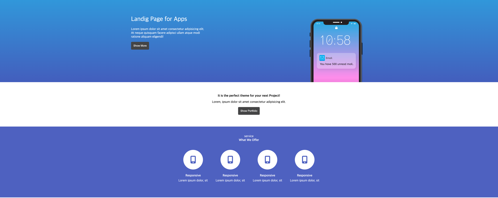
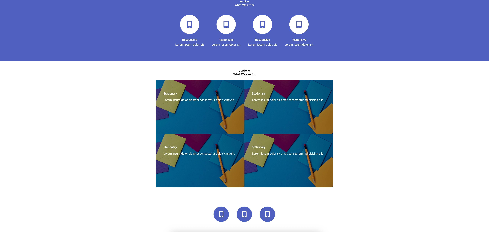

# SANDBURG R&D 퍼블리싱 실습 결과물 레포지토리

## 실습 자료 1

### 1. index.html 화면 상단



### 2. index.html 화면 하단



## git 실습 1

1. git 레포지토리 clone

```bash
$ git clone <레포지토리 주소>
```

2. 포트폴리오 폴더에 있는 프로젝트 파일 옮기기
3. branch 만들기

```bash
$ git branch keh
$ git branch # branch 목록확인
$ :q # 터미널에서 들어간 프로그램 나오기
$ git switch keh
```

4. 파일 add 하기
5. commit 메세지 작성 + 커밋 올리기
6. git에 push 하기

```bash
git push origin keh
```

---
